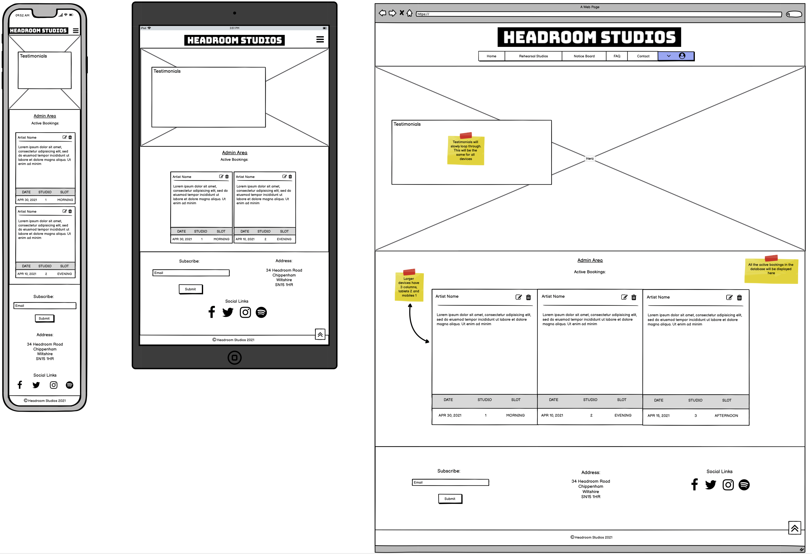
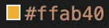

# Headroom Studios

## Designed & Developed by Jacob Roos

## Code Institute Milestone Project 3

Headroom Studios is a site built for musicians/creatives with an added sense of community. The business provides 3 rehearsal spaces that can be rented in blocks and is supplied with all the essential equipment that would be needed (apart from the instruments).  Bookings can be made/edited on a personal profile page once the user has registered and they're also able to contribute to the noticeboard where users can post items for sale, community events and job listings!  The site was designed with a simple and intuitive layout with a focus on ensuring booking flexibility and user feedback.  

A live version of the site is available [HERE](https://headroom-studios.herokuapp.com/).

# Table of Contents

1. [UX](#ux)
    * [Objectives](#objectives)
    * [User Stories](#user-stories)
    * [Wireframes](#wireframes)
    * [Responsive Design](#responsive-design)
2. [Content Styling](#content-styling)
3. [Features and Structure](#features-and-structure)
    *  [Navbar](#navbar)
    *  [Home](#home)
    *  [Rehearsal Studios](#rehearsal-studios)
    *  [Notice Board](#notice-board)
    *  [FAQ](#faq)
    *  [Contact](#contact)
    *  [Log In](#log-in)
    *  [Register](#register)
    *  [Bookings](#bookings)
    *  [Profile](#profile)
    *  [New Post](#new-post)
    *  [Admin](#admin)
    *  [Log Out](#log-out)
    *  [Footer](#footer)
4. [Database Structure](#database-structure)
5. [Future Features](#future-features)
6. [Technologies Used](#technologies-used)
    * [Languages](#languages)
    * [Libraries and Frameworks](#libraries-and-frameworks)
7. [Testing](#testing)
    * [Manual Testing](#manual-testing)
    * [DevTools](#devtools)
    * [Automated Testing](#automated-testing)
    * [User Story Testing](#user-story-testing)
    * [User Testing](#user-testing)
8. [Deployment](#deployment)
    * [Heroku Deployment](#heroku-deployment)
    * [Local Deployment](#local-deployment)
9. [Credits](#credits)
    * [Content](#content)
    * [Media](#media)
    * [Acknowledgements](#acknowledgements)
    * [Online and Physical](#online-and-physical)
        *  [Websites](#websites)
        *  [Books](#books)

# UX

## Objectives 

* The site should attract the attention of regional musicians looking for a place to rehearse
* The facilities and ethos needs to be clear and inviting
* The process to make a booking should be simple and users should be able to check availability
* The code needs to be scalable and allow for expansion if the business grows
* Adding a post to the cummunity notice board should be simple and editable
* The user needs to come away from the site knowing what's on offer and that there is a community spirit
* The user needs to be able to sign up to a mailing list and also to contact direct for queries
* Social links and business address needs to be displayed on all pages

## User Stories 

- As a visitor to the site I want to be able to clearly see the purpose of the site and services offered
- As a visitor I'd like the navigation to be simple and easy to follow
- As a visitor I want the site to be visually appealing and have a relevant colour scheme 
- As a visitor I want to be able to see photos of the rehearsal facilities and know their cost per hour
- As a visitor I would like to be able to connect with the local community
- As a visitor I would like to be able to make bookings and check availability
- As a visitor I want to be able to edit my booking 
- As a visitor I want to be able to post on the notice board and edit that post if required
- As a visitor I want to have feedback so I know wether my booking or post has been successful
- As a returning visitor I want to be able to see my active bookings and their relative information
- As a returning visitor I want to be able to update or remove my post on the community notice board

## Wireframes

### Home Page Wireframes

### Rehearsal Studios Wireframes

### Notice Board Wireframes

### FAQ Wireframes

### Contact Wireframes

The Contact tab is the same as the home page.  The contact form is located at the bottom and the link has a smooth-scroll effect added.

### Log In Wireframes

### Register Wireframes

### Bookings Wireframes

### Profile Wireframes

### Add Post Wireframes

### Admin Wireframes

### Log Out Wireframes

Log out is a simple route to remove the user using session.pop("user").  This then redirects to the home page

[Back to top](#table-of-contents)

## Responsive Design

Media queries have been added to ensure the site works well on smaller devices.  Materialize responsive classes were also used for parts of the layout.

* Home Page

The home page has a 3 column layout for 2 sections that stack for smaller devices.  The deign stays the same for tablets but collapses the navbar to a hamburger menu.

* Rehearsal Studios

The rehearsal studio page also keeps the 3 column layout and has the same principle applied for continuity.  Smaller devices stack and for tablet the design stays the same but changer the navbar to a hamburger menu.

* Notice Board

The notice board has responsive sizing so adapts to the viewport.  The posts in the notice board stay stacked with the only design change for smaller devices being the footer elements stacking which is the same for all pages.

* FAQ

The FAQ page is based around Materialize collapsible popout elements.  The design layout stays the same for all devices.  The collapsibles are in responsive containers.

* Contact

The form inside this section changes depending on the device and the text is also scaled down.

* Log In

The log in form is in a responsive container that resizes depending on the device.  I've also added media queries to extend the width for mobile devices.

* Register

The form inside the modal scales with devices and also increases in width for mobiles.

* Bookings

The bookings page has a 2 column layout that stacks for smaller devices.  The availability form has 2 inputs that are inline for larger devices and tablets but stack for mobiles.  The same priciple was applied to the lower booking form which has 3 elements that stack for mobile devices.

* Profile

The user profile page has a simle username title followed by active bookings.  For desktop devices a 3 column layout is used.  For tablets this scales down to 2 and mobiles to 1.

* New Post

The form inside this section is in a responsive container and scales for smaller devices.

* Admin (Admin only)

This admin page has the same concept as the profile pages.  Larger devices are 3 columns, tablets 2 and mobiles one.

* Log Out

The log out tab doesn't go to a separate page.  It simply logs the user out and returns them to the log in page.

[Back to top](#table-of-contents)

# Content Styling

## Colours

The colours for the site were decided based on competitor sites and also taking into consideration current colour trends. The pallette consists of a light teal green, black, wite, charcoal and a flash of orange.

The fonts all remain black and white for contrast and to improve readability.  

## Fonts

The fonts that were used on the site are "**Bungee**" and "**Roboto**".  The style of the Bungee font was inline with the slightly darker vibe and worked well as a standalone Logo font.  Roboto is a modern easy to read font that was complimentary to the bungee logo font.

[Back to top](#table-of-contents)

# Features and Structure

The site is layed out in a simple structure with smooth scrolling on the home page for the contact section and a small blurb describing the ethos of headroom studios and what facilities are available.  The Hero is consistent over all pages and has a selection of quotes from the biggest hypothetical clients that cycles through.  
All sections are focussed around a row and a 3 column layout separated with full width container sections.  The details for each page are listed below:

The main sections that were decided upon were:

* Home
* Rehearsal Studios
* Notice Board
* FAQ
* Contact
* Log In
* Register

The other sections that become available to the user once registered and logged in are:

* Bookings
* Profile
* New Post
* Admin (admin only)
* Log Out

I decided to add a user icon to the navbar with a dropdown once the user is logged in to minimise the visible tabs.  This helped to streamline the design as all of those links on one line was a bit too much!

## Navbar

* The Navbar has a Navbar brand for the website logo and 7 addition links - Home, Rehearsal Studios, Notice Board, FAQ, Contact, Log In & Register
* The Register tab links to a modal instead of a separate page.
* When logged in a user icon appears instead of log in and register. These links also become available: Bookings, Profile, Add Post, Manage Bookings (admin) & Log Out
* All the links have a hover effect and an active state when selected
* Materialize was used to create a collapsible dropdown (hamburger menu) for smaller devices that comes in from the right side of the screen

## Home

* The Home page/landing page has a hero image with a rotation of customer quotes. This functionlity was created using an interval function in JS
* Further down the page you have a small blurb about the business and what services are offered
* Underneath this there is a full width div with 6 icons highlighting the key points that make headroom studios an ideal choice for creatives
* Below this is the contact form that has a success/error modal that is displayed once the form is submitted.  Using emailJS the user is then emailed with a confirmation and the admin is sent the message that was submitted.

## Reheasal Rooms

* The page opens with a small blurb telling the user how the booking system works and includes relevant links to the sections mentioned
* Below this section I added 3 cards for the rehearsal studios with Materialize
* Each card has a small blurb about the room and its 'vibe' and includes a link to view more images
* Once the user clicks on the 'MORE IMAGES' link a modal pops up allowing the user to scroll through images of that studio
* The sizing of the images adjust depending on the device and I altered the original Materialize functionality by including prev and next arrow instead of the built in circle icons.  I decided on this due to there being quite a few images and with all the dot icons it was a bit much to navigate especially on smaller devices.

## Notice Board

* This section is made up of set of collections that are looped through and displayed with jinja/python
* The content is initially submitted through an active user which is stored on mongoDB and then brought back in with python/jinja
* There is also an if/else loop to dynamically add the category icon to the post
* The user that submits the post has to provide a contact email address which is assigned to the mail icon using jinja
* The username is also posted underneath the post title with an exclamation mark if the post was labelled as urgent
* Underneath this is a date stamp that was created using the datetime package in python and formatted using the strftime() function
* There is also pagination added with a maximum amount of posts set to 6 items before the next pages are made active

## FAQ

* The code for this page was kept simple using a Materialize collection and a set of typical questions that might be asked by users of the studio
* In terms of its design it's simple and to the point with a question answer layout
* The idea behind adding the page is purely for extra information that would be essential for a real life business!

## Contact

* The contact section contains a Materialize form with a simple opening blurb and contains 4 sections
* All sections are labelled as required and show their relevant input errors and suggestions
* A modal was added with JS and displays either a success or error message depending on the submission response
* EmailJS was used to create an email template and also an auto-reply

## Log In

* The log in page has a simple 2 section form asking for a username and password
* Python is used to then check on the mongo database if the user exists.  If the user exists they're welcomed and redirected to their profile.  If not then an error is flashed and the user is redirected back to the login page

## Register

* I decided to go for a modal for the registration to mix up the UI with something different to another page
* The modal has a 3 part form asking for a username, email and password
* This data is then stored on mongo and called upon as the 'session user' 
* The database is also checked initially on the registration and an error message is flashed if the user exists and success if the registration was a success with the user being redirected to the home page

## Bookings

* The bookings page has 2 main sections: Firstly to check availability and then to make a booking
* The section that checks availability asks the user to input a date and time. The database is then referenced using python and flashes a message saying which studio(s) are available on that date and time
* This allows for the user to make a quick check before moving ahead an filling in the main booking form
* There are required restrictions on the inputs to ensure they're filled in correctly. This functionality needed to be added seperately for the Materialize select dropdowns using JS
* The booking form then asks for date, studio, time, artist/contact name and allows a message for any special requests
* This information is stored on mongoDB and is then displayed using jinja on the user profile and also the admin page for the admin user
* Only bookings made by that user will be displayed on their profile.  I also added a sort function into the jijna loop to display the bookings in date order
* Success and error flash messages are also set up for booking confirmation

## Profile

* This is a simple page where the user can reference their active bookings and make changes or a cancellation
* The booking information is displayed in a card and includes en edit and delete icon 
* If the user wants to edit a booking the user gets transferred to a form screen that has the date and contact prefilled
* If the user tries to change to a date already booked an error is flashed and they're redirected to the bookings page where they can check availability
* Otherwise if the change is a success then the booking is updated and the changes are shown on the user profile
* If a user wants to delete a booking they simply press the delete icon which loads a confirmation modal. If the user agrees to delete then the booking is removed from the database and a confirmation flash message pops up

## New Post

* The new post page takes the user to a form that allows the user to fill in a category, title, message, email and if the post is urgent
* This information is stored on mongoDB and then looped through using jinja on the notice board page
* Once the post has been added, the user gets a confirmation flash message and the post is listed on the notice board
* This post can then be edited or deleted on the notice board page.  The delete button loads a confirmation modal and if the user chooses to delete the post it gets removed from the notice board and the database.  The edit post works in the same was as the edit booking function where the user gets taken to a form that has a some elements prefilled and then the changes are updated using the .update() function

## Admin

* This page is only available for the admin user
* It works in a similar way to the profile page but the jijna loop shows all the bookings currently in the database in date order
* The admin isn't able to edit the bookings however does have the ability to delete the bookings for potential cancellations made not via the website (hypothetically)

## Log Out

* This is a simple nav link that logs out the user using session.pop("user") and then redirects them to the log in page with a flash confirmation message

## Footer

* The footer includes a sign-up email form, address and social media links
* The sign up form puts the user email into a subscribers collection and flashes a success message.  This database can then be used by the admin for marketing purposes
* All social links have hover effects and currently link to the root websites but would be linked to the relevant pages were this a functioning business

[Back to top](#table-of-contents)

# Database Structure

## Bookings

1. ObjectId - (created by mongoDB)
2. studio - string
3. date - datetime object
4. slot - string
5. contact_name - string
6. additional_info - string
7. created_by - string

## Posts

1. ObjectId - (created by mongoDB)
2. post-title - string
3. post-message - string
4. is_urgent - string
5. category - string
6. created_by - string
7. email - string
8. date_posted - datetime object

## Users

1. ObjectId - (created by mongoDB)
2. username - string
3. email - string
4. password - string (hashed password)

## Subscribers

1. ObjectId - (created by mongoDB)
2. email - string

[Back to top](#table-of-contents)

# Future Features

The site is definitely functional however I feel that a dynamic calendar system would be advantageous and also having the ability to pay for bookings online would be ideal. I would also love to be able to implement a feature where an invoice is automatically generated and sent after a booking.  
There is also a system that I've seen used where you can send the user a code, which can then be used to unlock the studio door which would simplify the setup even more.  

* ## Known Issues

As this is a project site there are a few things that would be changed for a commercial site.  Firstly the social media links would be linked to the appropriate pages as currently these are only linked to the home pages.  The Email.js return email would be a working business email address as this is currently my own. Also there seems to be an error where the quotes that loop are displayed stacked instead of one at a time if you leave the website tab and then return.

* ## Ideas

I chose to do this as a project due to a close friend owning a rehearsal studio and this being a potential prototype to expand on.  His intention is the add recording facilities and also link to his external site which contains work of his film compositions.  

[Back to top](#table-of-contents)

# Technologies Used

## Languages

- #### HTML, CSS, JavaScript, Python

## Libraries and Frameworks

* #### [Materialize](https://materializecss.com/)
    * Used for layout, forms and navbar 
* #### [Font Awesome](https://fontawesome.com/)
    * Used for all icons
* #### [Google Fonts](https://fonts.google.com/)
    * Used for site fonts
* #### [jQuery](https://jquery.com/)
    * Used for site manipulation and to simplify JavaScript selectors
* #### [flask & Jinja](https://flask.palletsprojects.com/en/1.1.x/)
    * Used to write the backend code with python and to implement in the frontend with jinja
* #### [Email.js](https://www.emailjs.com/)
    * Used to send contact form submission data to developer and response to the user

[Back to top](#table-of-contents)

# Testing

## Manual Testing

### Testing was done using the following browsers:

* Google Chrome
* Safari
* Firefox

### Devices used:

*Only Google Chrome and Safari were used for testing on the below devices*

* Iphone 7
* Ipad 3rd Generation 

### Functionality Checklist

UI Test Description | Desktop | Laptop | Ipad | Iphone 
|-------|---------|--------|------|-----------
Live site loads on all devices | ✅ | ✅ | ✅ | ✅ 
Images display correctly | ✅ | ✅ | ✅ | ✅  
Text is formatted as expected | ✅ | ✅ | ✅ | ✅ 
Hover effects work | ✅ | ✅ | ✅ | ✅ 
All buttons display correctly | ❌ | ❌ | ❌ | ❌ 
Check to see if navbar collapses on smaller devices | ✅ | ✅ | ✅ | ✅ 
User dropdown link appears in navbar when logged in | ✅ | ✅ | ✅ | ✅ 
Hero Img quotes display and fade smoothly | ✅ | ✅ | ✅ | ✅ 
Contact link scrolls to relevant position | ✅ | ✅ | ✅ | ✅  
The contact form displays correct predicted inputs | ✅ | ✅ | ✅ | ✅ 
Contact form displays required fields if not filled in | ✅ | ✅ | ✅ | ✅ 
Contact form does not submit if fields aren't filled in | ✅ | ✅ | ✅ | ✅ 
Contact form modal displays on successful submission | ✅ | ✅ | ✅ | ✅ 
Message is sent to developer email address | ✅ | ✅ | ✅ | ✅ 
Auto-reply is sent to user | ✅ | ✅ | ✅ | ✅ 
Social links are visible and sized appropriately | ✅ | ✅ | ✅ | ✅ 
Footer is visible and sized appropriately | ✅ | ✅ | ✅ | ✅ 
Subscribe displays correct flash messages and adds email to db | ✅ | ✅ | ✅ | ✅
Images on rehearsal studio page loads and resized for smaller devices | ✅ | ✅ | ✅ | ✅ 
Notice board displays correctly | ✅ | ✅ | ✅ | ✅
Edit and delete buttons display for session user posts | ✅ | ✅ | ✅ | ✅
Pagination increases after 6 posts | ✅ | ✅ | ✅ | ✅
All relevant flash messages/modals display for edit and delete posts | ✅ | ✅ | ✅ | ✅
The mail icon input the correct user email | ✅ | ✅ | ✅ | ✅
FAQ page collapsible loads and resizes for smaller devices | ✅ | ✅ | ✅ | ✅
Bookings page forms display correctly | ✅ | ✅ | ✅ | ✅
Availablity checker works correctly and flashes correct messages | ✅ | ✅ | ✅ | ✅
Booking form displays correct error and confirmation flash messages | ✅ | ✅ | ✅ | ✅
Confirmed bookings redirect to profile and displays correctly | ✅ | ✅ | ✅ | ✅
Profile page displays session user bookings | ✅ | ✅ | ✅ | ✅
Admin page displays all bookings | ✅ | ✅ | ✅ | ✅
Both Admin and profile page display bookings in date order | ✅ | ✅ | ✅ | ✅
Both Admin and profile page display out of date bookings in red | ✅ | ✅ | ✅ | ✅
Add post page displays form correctly | ✅ | ✅ | ✅ | ✅
Add post page prevents submission if required fields aren't completed | ✅ | ✅ | ✅ | ✅
Add post page redirects to notice board and displays post | ✅ | ✅ | ✅ | ✅
Log Out removes the session user and redirects to the home page | ✅ | ✅ | ✅ | ✅
All flash messages display correctly | ✅ | ✅ | ✅ | ✅
All columns collapse as they should for smaller devices | ✅ | ✅ | ✅ | ✅
Check all user stories implemented | ✅ | ✅ | ✅ | ✅ 

## Errors and solutions

* All buttons display correctly:

There was an error during testing where the "Make a Booking" button on the rehearsal studios page had a grey to white gradient instead of the teal green. This was fixed by adding the following css:

### Known errors

There is an error where the faded quotes that appear over the hero-img stack and display more than one if you leave the browser tab and later return.  This then goes away and returns to just one quote when the timeout function repeats. I haven't found a solution to this error but from the research I've done it seems like the browser changes the way some JS displays if the tab is inactive.

## DevTools

Chrome Devtools was used during the development process and used extensively for testing. All devices were checked for functionality and visual errors. It was also used to target certain elements of the site to check changes before adding them to the code.

The console was used to support the development process of the website JavaScript. All errors were satisfied and the project currently has none outstanding.

## Automated testing

* HTML was validated using [W3C HTML Markup Validation Service](https://validator.w3.org/)

The validation came back with minor issues including an error as I had a href within an < i > tag which I changed and wrapped in an < a > tag.

* CSS was validated using [W3C CSS Markup Validation Service](https://jigsaw.w3.org/css-validator/)

The only error returned here was that I used margin:revert which I swapped out for a flex display with all content aligned in the center and then added a custom margin-top.

* JS was validated using [jshint JS Markup Validation Service](https://jshint.com/)

The JS validation returned some warnings due to the use of ES6 syntax which might not be compatible with older browsers. Other than this it was mainly a few missing semicolons.

[Back to top](#table-of-contents)

## User Story Testing

#### As a visitor to the site I want to be able to clearly see the purpose of the site and services offered

* On arriving to the site the logo is eye catching and the image gives the right impression for the purpose of the website
* The quotes from previous clients are relevant and gives the impression of a successful and modern facility
* The links at the top are all relevant and applicable to the services offered
* Once scrolling down on the home page there is a short introduction that clarifies the facilities offered and how the system works

#### As a visitor I'd like the navigation to be simple and easy to follow.

* The navigation links are clearly visible and there are no broken links
* There aren't too many links and the hover effects add some colour to the site and improve UX
* The central position of the links works well with the layout of the site

#### As a visitor I want the site to be visually appealing and have a relevant colour scheme.

* The colours are simple and modern with a lot of contrast making all the text content easy to read
* The vibrance of the orange adds a nice touch and works well with the teal green

#### As a visitor I want to be able to see photos of the rehearsal facilities and know their cost per hour.

* Upon reaching the rehearsal rooms page it is clear there are 3 studios and I'm able to see a number of images to better inform my booking decision
* Each studio has a small description giving more information on the vibe and also includes the ourly price which is highlighted for clarity

#### As a visitor I would like to be able to connect with the local community.

* When landing on the notice board page I can see all the posts made by users and their relevant catagories 
* I'm directed to sign up and once logged in there is a clear user icon with an extended nav menu allowing me to add a post of my own
* If I find an add that's relevant to me then I'm also able to contact them via email by clicking the mail icon next to the post

#### As a visitor I would like to be able to make bookings and check availability.

* Once registered I have a bookings tab added to my user menu where I can check availability and add a booking of my own
* The forms give me relevant feedback and the availability checker speeds up the process if I want to check a few dates that work with my colleagues  

#### As a visitor I want to be able to edit my booking.

* If I want to make a change to my booking I can do so on my profile page
* There are two clear icons to either delete my booking or do edit it
* The edit page has some of the key information pre-filled which speeds up the process 
* I also get feedback for any dates and times that clash with existing bookings

#### As a visitor I want to be able to post on the notice board and edit that post if required.

* Once logged in I'm able to add my own post to the community notice board
* I can also edit or delete my posts on the notice board page with the added buttons that become visible next to my post

#### As a visitor I want to have feedback so I know wether my booking or post has been successful.

* When making a bookings or adding a post I get a flash message once either my booking or post has been successful or not
* When a booking wasn't possible I'm told why and redirected to the bookings page to make changes 

#### As a returning visitor I want to be able to see my active bookings and their relative information.

* When the time comes to check my active bookings I can simply log in and head to my profile page where the bookings are displayed
* All bookings are displayed in date order so I clearly know which booking is the soonest

#### As a returning visitor I want to be able to update or remove my post on the community notice board.

* When returning to the notice board, once logged in I can see the edit and delete Icons next to my post
* This speeds up the process for if I've either sold and item or found what I was looking for within the community
* I'm informed during the edit and delete processes whether they've been successful or not

## User Testing 

### My Mentor (Dick Vlaanderen)

When using the site my mentor mentioned that the original font was a little hard to read so I changed the overall font to the PT-sans style. This change greatly imoproved the user experience while still working aesthetically with the site.

### A Fellow Code Institue Student

The site was thouroughly tested by a fellow CI student and some valueble feedback given which was implemented to improve the UX.  

[Back to top](#table-of-contents)

# Deployment

### Heroku Deployment

* [LIVE SITE](https://headroom-studios.herokuapp.com/)
    * Below is a step by step for the hosting process:
       
    1. Set *_debug=False_* in the app.py file.
    2. Create a requirements.txt file using *_pip3 freeze --local > requirements.txt_* in the terminal.  This tells heroku what dependencies the app has to run. In the case of Headroom Studios the requirements filre contained the following:
        * click==7.1.2
        * dnspython==2.1.0
        * Flask==1.1.2
        * Flask-PyMongo==2.3.0
        * itsdangerous==1.1.0
        * pymongo==3.11.3
        * Werkzeug==1.0.1
    3. Create a Procfile using the *_echo web: python app.py > Procfile_* command in the terminal so Heroku knows which file runs the app.
    4. Create a new Heroku app: *headroom-studios* and set its region to Europe.
    5. Set up automatic deployment by linking the newly created app to the github repository.  This is done by selecting the "Connect to Github" in the deploy menu then adding the repo name and selecting it for deployment.
    6. The next step is to add the app environment variables.  This is done by going to the *Reveal Config Vars* section and copying over the variables from the app *env(dot)py* file ensuring not to use any quotations.
        *  *IP* 
        *  *PORT*
        * *SECRET_KEY*
        * *MONGO_URI*
        * *MONGO_DBNAME*
    7. The *Enable Automatic Deploys* button was activated, ensuring that all app commits are up to date on the master branch before doing this.
    8. The Branch is then deployed and the app uploaded
    9. Once this is complete you can press the view button under the window to see the deployed site
    10. Due to the app being connected to the GitHub repo any code pushed to github will automatically update on the live site

## Local Deployment 

* Login to Github and select the project repository.
* Click on the Gitpod dropdown and download the files as a ZIP.
* Ensure that Git software is installed locally.
* Expand the ZIP file and double click the index.html file

The project can also be cloned within the terminal using git clone. For more information on using git clone you can click [HERE](https://docs.github.com/en/free-pro-team@latest/github/creating-cloning-and-archiving-repositories/cloning-a-repository)

[Back to top](#table-of-contents)

# Credits 

## Content       

All content on the site was designed and written by myself 

## Media

The Hero img was sourced from [Shutterstock](www.shutterstock.com). 
General search terms were music studio & rehearsal space.
The files were downloaded as high resolution JPEG files and then resized for their various applications 

The studio images were provided by a friend who runs a rehearsal studio [Glasshouse Studios](http://glasshousestudios.org/).
These files were downloaded as JPEG files directly from the wesbite and then resized for their various applications 

## Acknowledgements

I've had excellent support from my Mentor Dick Vlaanderen and also from the code institute tutors.
The slack community has also been very helpful for feedback and support.

## Online and Physical

### Websites

* [Stack Overflow](https://stackoverflow.com/)
* [W3schools](https://www.w3schools.com/)
* [CSS-Tricks](https://css-tricks.com/)
* [Full Stack Python](https://www.fullstackpython.com/)

 ### YouTube Channels

* [Dev Ed](https://www.youtube.com/channel/UClb90NQQcskPUGDIXsQEz5Q)
* [DesignCourse](https://www.youtube.com/user/DesignCourse)
* [The Coding Train](https://www.youtube.com/user/shiffman)
* [Corey Schafer](https://www.youtube.com/user/schafer5)

### Books

* Head First HTML & CSS - *O'reilly*
* Head First Javascript Programming - *O'reilly*
* JavaScript Testing with Jasmine - *O'reilly*
* Learn Python In One Day - *Jamie Chan*
* Flask Web Development - *Miguel Grinberg*

[Back to top](#table-of-contents)